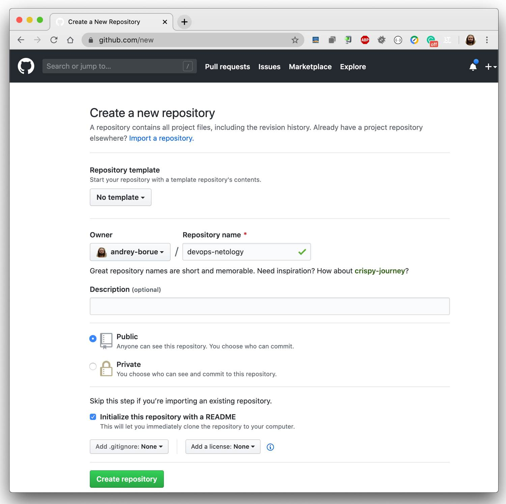

# Домашнее задание к занятию «2.1. Системы контроля версий»

### Цель задания

В результате выполнения этого задания вы научитесь подготоваливать новый репозиторий к работе, а также сохранять, перемещать и удалять файлы в системе контроля версий.  

### Чеклист готовности к домашнему заданию

1. Установлена консольная утилита для работы с git.

### Инструкция к заданию

1. Домашнее задание выполните в github репозитории. 
2. В личном кабинете отправьте на проверку ссылку на ваш репозитории с домашним заданием.
3. Любые вопросы по решению задач задавайте в чате учебной группы.

### Инструменты и дополнительные материалы, которые пригодятся для выполнения задания

1. [Github](https://github.com/)
2. [Инструкция по установке git](https://git-scm.com/downloads)   
   
   

------

## Задание 1. Создать и настроить репозиторий для дальнейшей работы на курсе.

В рамках курса мы будем писать скрипты и создавать конфигурации для различных систем, которые необходимо сохранять для будущего использования. 
Поэтому первым делом надо создать и настроить локальный репозиторий, после чего добавить удаленный репозиторий в github.

### Создание репозитория и первого коммита:

1. Зарегистрируйте аккаунт на https://github.com/ (если вы предпочитаете другое хранилище для репозитория, можно использовать его).
2. Создайте публичный репозиторий, который будете использовать дальше на протяжении всего курса, желательное название `devops-netology`.
   Обязательно поставьте галочку `Initialize this repository with a README`. 
    
3. Создать [авторизационный токен](https://docs.github.com/en/authentication/keeping-your-account-and-data-secure/creating-a-personal-access-token) для клонирования репозитория
4. Склонируйте репозиторий, используя https протокол (`git clone ...`) 
    
5. Перейдите в каталог с клоном репозитория (`cd devops-netology`)
6. Произведите первоначальную настройку git, указав свое настоящее имя (пожалуста, используйте настоящие имена, 
нам так будет проще общаться) и email (`git config --global user.name` и `git config --global user.email johndoe@example.com`).
7. Выполните команду `git status` и запомните результат.
8. Отредактируйте файл `README.md` любым удобным способом, тем самым переведя файл в состояние `Modified`.
9. Еще раз выполните `git status` и продолжайте проверять вывод этой команды после каждого последующего шага. 
10. Давйте теперь посмотрим изменения в файле `README.md` выполнив команды `git diff` и `git diff --staged`.
11. Переведите файл в состояние `staged` (или как говорят просто добавьте файл в коммит) командой `git add README.md`.
12. И еще раз выполните команды `git diff` и `git diff --staged`. Поиграйте с изменениями и этими командами, чтобы четко понять
что и когда они отображают. 
13. Теперь можно сделать коммит `git commit -m 'First commit'`.
14. И еще раз посмотреть выводы команд `git status`, `git diff` и `git diff --staged`.

### Создание файлов `.gitignore` и второго коммита:

1. Создайте файл `.gitignore` (обратите внимание на точку в начале файла), проверьте его статус сразу после создания. 
1. Добавьте файл `.gitignore` в следующий коммит (`git add...`).
1. На одном из следующих блоков мы будем изучать `Terraform`, давайте сразу же создадим соотвествующий каталог `terraform` и внутри
этого каталога файл `.gitignore` по этому примеру: https://github.com/github/gitignore/blob/master/Terraform.gitignore.  
1. В файле `README.md` опишите своими словами какие файлы будут проигнорированы в будущем благодаря добавленному `.gitignore`.
1. Закоммитьте все новые и измененные файлы. Комментарий к коммиту должен быть `Added gitignore`.

### Эксперимент с удалением и перемещением файлов (третий и четвертый коммит)

1. Создайте файлы `will_be_deleted.txt` (с текстом `will_be_deleted`) и `will_be_moved.txt` (с текстом `will_be_moved`) и закоммите их с комментарием `Prepare to delete and move`.
1. В случае необходимости обратитесь к [официальной документации](https://git-scm.com/book/ru/v2/Основы-Git-Запись-изменений-в-репозиторий),
здесь подробно описано как выполнить последующие шаги. 
1. Удалите файл `will_be_deleted.txt` с диска и из репозитория. 
1. Переименуйте (переместите) файл `will_be_moved.txt` на диске и в репозитории, чтобы он стал называться `has_been_moved.txt`.
1. Закоммитьте результат работы с комментарием `Moved and deleted`.

### Проверка изменения

1. В результате предыдущих шагов в репозитории должно быть как минимум пять коммитов (если вы еще сделали какие-нибудь промежуточные – нет проблем):
    * `Initial Commit` – созданный гитхабом при инициализации репозитория. 
    * `First commit` – созданный после изменения файла `README.md`.
    * `Added gitignore` – после добавления `.gitignore`.
    * `Prepare to delete and move` – после добавления двух временных файлов.
    * `Moved and deleted` – после удаления и перемещения временных файлов. 
2. Проверьте это используя комманду `git log` (подробно о формате вывода этой команды мы поговорим на следующем занятии, 
но посмотреть, что она отображает, можно уже сейчас).

### Отправка изменений в репозиторий

1. Выполните команду `git push`, если git запросит логин и пароль – введите ваш логин и пароль от github. 

*В качестве результата выполнения задания приложите ссылку на репозиторий* 

## Задание 2. Знакомство с документаций

Один из основных навыков хорошего специалиста это уметь самостоятельно находить ответы на возникшие вопросы.  
Чтобы начать знакомиться с документацией просто выполните в консоли команды `git --help`, `git add --help` и изучите их вывод.  
 
----

### Правила приема домашнего задания

- В личном кабинете отправлена ссылка на ваш репозитории.

### Критерии оценки

Зачет - выполнены все задания, ответы даны в развернутой форме, приложены соответствующие скриншоты и файлы проекта, в выполненных заданиях нет противоречий и нарушения логики.

На доработку - задание выполнено частично или не выполнено, в логике выполнения заданий есть противоречия, существенные недостатки.
