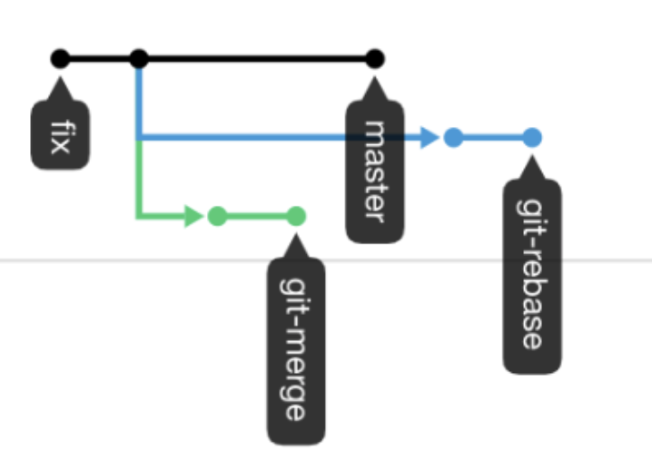
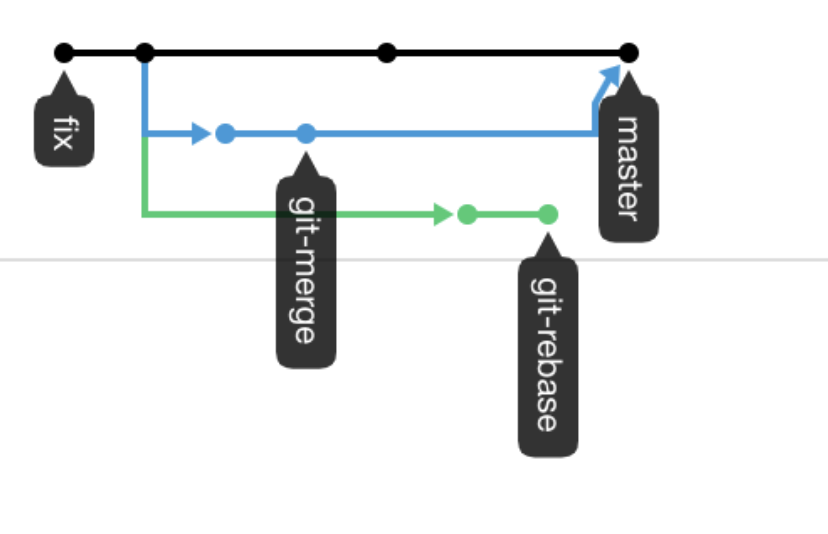

# Домашнее задание к занятию «2.3. Ветвления в Git»

Давайте потренеруемся делать merge и rebase, чтобы понять разницу и научиться решать конфликты.

## Задание №1 – Ветвление, merge и rebase. 

1. Предположим, что есть задача написать скрипт, выводящий на экран параметры его запуска. 
Давайте посмотрим, как будет отличаться работа над этим скриптом с использованием ветвления, мержа и ребейза. 
Создайте в своем репозитории каталог `branching` и в нем два файла `merge.sh` и `rebase.sh` с 
содержимым:
```bash
#!/bin/bash
# display command line options

count=1
for param in "$*"; do
    echo "\$* Parameter #$count = $param"
    count=$(( $count + 1 ))
done
```

Этот скрипт отображает на экране все параметры одной строкой, а не разделяет их.

2. Создадим коммит с описанием `prepare for merge and rebase` и отправим его в ветку мастер. 

#### Подготовка файла merge.sh.
1. Создайте ветку `git-merge`. 
1. Замените в ней содержимое файла `merge.sh` на
```bash
#!/bin/bash
# display command line options

count=1
for param in "$@"; do
    echo "\$@ Parameter #$count = $param"
    count=$(( $count + 1 ))
done
```
3. Создайте коммит `merge: @ instead *` отправьте изменения в репозиторий.
4. И разработчик подумал и решил внести еще одно изменение в `merge.sh` 
```bash
#!/bin/bash
# display command line options

count=1
while [[ -n "$1" ]]; do
    echo "Parameter #$count = $1"
    count=$(( $count + 1 ))
    shift
done
```
Теперь скрипт будет отображать каждый переданный ему параметр отдельно. 

5. Создайте коммит `merge: use shift` и отправьте изменения в репозиторий. 

#### Изменим master.
1. Вернитесь в ветку `master`. 
2. Предположим, что кто-то, пока мы работали над веткой `git-merge`, изменил `master`. Для этого
изменим содержимое файла `rebase.sh` на следующее
```bash
#!/bin/bash
# display command line options

count=1
for param in "$@"; do
    echo "\$@ Parameter #$count = $param"
    count=$(( $count + 1 ))
done

echo "====="
```
В этом случае скрипт тоже будет отображать каждый параметр в новой строке. 

3. Отправляем измененную ветку `master` в репозиторий.

#### Подготовка файла rebase.sh.
1. Предположим, что теперь другой участник нашей команды 
не сделал `git pull`, либо просто хотел ответвиться не от 
последнего коммита в `master`, а от коммита когда мы только создали два файла
`merge.sh` и `rebase.sh` на первом шаге.  
Для этого при помощи команды `git log` найдем хэш коммита `prepare for merge and rebase` 
и выполним `git checkout` на него примерно так:
`git checkout 8baf217e80ef17ff577883fda90f6487f67bbcea` (хэш будет другой).
1. Создадим ветку `git-rebase` основываясь на текущем коммите. 
1. И изменим содержимое файла `rebase.sh` на следующее, тоже починив скрипт, 
но немного в другом стиле
```bash
#!/bin/bash
# display command line options

count=1
for param in "$@"; do
    echo "Parameter: $param"
    count=$(( $count + 1 ))
done

echo "====="
```
4. Отправим эти изменения в ветку `git-rebase`, с комментарием `git-rebase 1`.
5. И сделаем еще один коммит `git-rebase 2` с пушем заменив `echo "Parameter: $param"` 
на `echo "Next parameter: $param"`.

#### Промежуточный итог. 
Мы сэмулировали типичную ситуации в разработке кода, когда команда разработчиков 
работала над одним и тем же участком кода, причем кто-то из разработчиков 
предпочитаем делать `merge`, а кто-то `rebase`. Конфилкты с merge обычно решаются достаточно просто, 
а с rebase бывают сложности, поэтому давайте смержим все наработки в `master` и разрешим конфликты. 

Если все было сделано правильно, то на странице `network` в гитхабе, находящейся по адресу 
`https://github.com/ВАШ_ЛОГИН/ВАШ_РЕПОЗИТОРИЙ/network` будет примерно такая схема:


#### Merge
Сливаем ветку `git-merge` в мастер и отправляем изменения в репозиторий, должно получиться без конфликтов:
```bash
$ git merge git-merge
Merge made by the 'recursive' strategy.
 branching/merge.sh | 5 +++--
 1 file changed, 3 insertions(+), 2 deletions(-)
$ git push
#!/bin/bash
Enumerating objects: 1, done.
Counting objects: 100% (1/1), done.
Writing objects: 100% (1/1), 223 bytes | 223.00 KiB/s, done.
Total 1 (delta 0), reused 0 (delta 0), pack-reused 0
```  
В результате получаем такую схему:


#### Rebase
1. А перед мержем ветки `git-rebase` выполним ее `rebase` на мастер. Да, мы специально создали
ситуацию с конфликтами, чтобы потренироваться их решать. 
1. Переключаемся на ветку `git-rebase` и выполняем `git rebase -i origin/master`. 
В открывшемся диалоге должно быть два выполненных нами коммита, давайте заодно объединим их в один, 
указав слева от нижнего `fixup`. 
В результате получаем что-то подобное:
```bash
$ git rebase -i origin/master
Auto-merging branching/rebase.sh
CONFLICT (content): Merge conflict in branching/rebase.sh
error: could not apply dc4688f... git 2.3 rebase @ instead *
Resolve all conflicts manually, mark them as resolved with
"git add/rm <conflicted_files>", then run "git rebase --continue".
You can instead skip this commit: run "git rebase --skip".
To abort and get back to the state before "git rebase", run "git rebase --abort".
Could not apply dc4688f... git 2.3 rebase @ instead *
``` 
Если посмотреть содержимое файла `rebase.sh`, то увидим метки, оставленные гитом для решения конфликта:
```bash
cat rebase.sh
#!/bin/bash
# display command line options

count=1
for param in "$@"; do
    echo "\$@ Parameter #$count = $param"
    count=$(( $count + 1 ))
done
```
Удалим метки, отдав предпочтение варианту
```bash
echo "\$@ Parameter #$count = $param"
```
сообщим гиту, что конфликт решен `git add rebase.sh` и продолжим ребейз `git rebase --continue`.

И опять в получим конфликт в файле `rebase.sh` при попытке применения нашего второго коммита. 
Давайте разрешим конфликт, оставив строчку `echo "Next parameter: $param"`.

Далее опять сообщаем гиту о том, что конфликт разрешен `git add rebase.sh` и продолжим ребейз `git rebase --continue`.
В результате будет открыт текстовый редактор предлагающий написать комментарий к новому объединенному коммиту:
```
# This is a combination of 2 commits.
# This is the 1st commit message:

Merge branch 'git-merge'

# The commit message #2 will be skipped:

# git 2.3 rebase @ instead * (2)
```
Все строчки начинающиеся на `#` будут проигнорированны. 

После сохранения изменения, гит сообщит
```
Successfully rebased and updated refs/heads/git-rebase
```
И попробуем выполнить `git push`, либо `git push -u origin git-rebase` чтобы точно указать что и куда мы хотим запушить. 
Эта команда завершится с ошибкой:
```bash
git push
To github.com:andrey-borue/devops-netology.git
 ! [rejected]        git-rebase -> git-rebase (non-fast-forward)
error: failed to push some refs to 'git@github.com:andrey-borue/devops-netology.git'
hint: Updates were rejected because the tip of your current branch is behind
hint: its remote counterpart. Integrate the remote changes (e.g.
hint: 'git pull ...') before pushing again.
hint: See the 'Note about fast-forwards' in 'git push --help' for details.
```
Это произошло, потому что мы пытаемся перезаписать историю. 
Чтобы гит позволил нам это сделать, давайте добавим флаг `force`:
```bash
git push -u origin git-rebase -f
Enumerating objects: 10, done.
Counting objects: 100% (9/9), done.
Delta compression using up to 12 threads
Compressing objects: 100% (4/4), done.
Writing objects: 100% (4/4), 443 bytes | 443.00 KiB/s, done.
Total 4 (delta 1), reused 0 (delta 0), pack-reused 0
remote: Resolving deltas: 100% (1/1), completed with 1 local object.
To github.com:andrey-borue/devops-netology.git
 + 1829df1...e3b942b git-rebase -> git-rebase (forced update)
Branch 'git-rebase' set up to track remote branch 'git-rebase' from 'origin'.
```

Теперь можно смержить ветку `git-rebase` в мастер без конфликтов. 


Цель задания - попробовать на практике то, как выглядит решение конфликтов.
Обычно при нормальном ходе разработки выполнять `rebase` достаточно просто, 
что позволяет объединить множество промежуточных коммитов при решении задачи, чтобы 
не засорять историю, поэтому многие команды и разработчики предпочитают такой способ.   


Есть еще такой тренажер https://learngitbranching.js.org/, где можно потренироваться в работе с 
деревом коммитов и ветвлений. 

